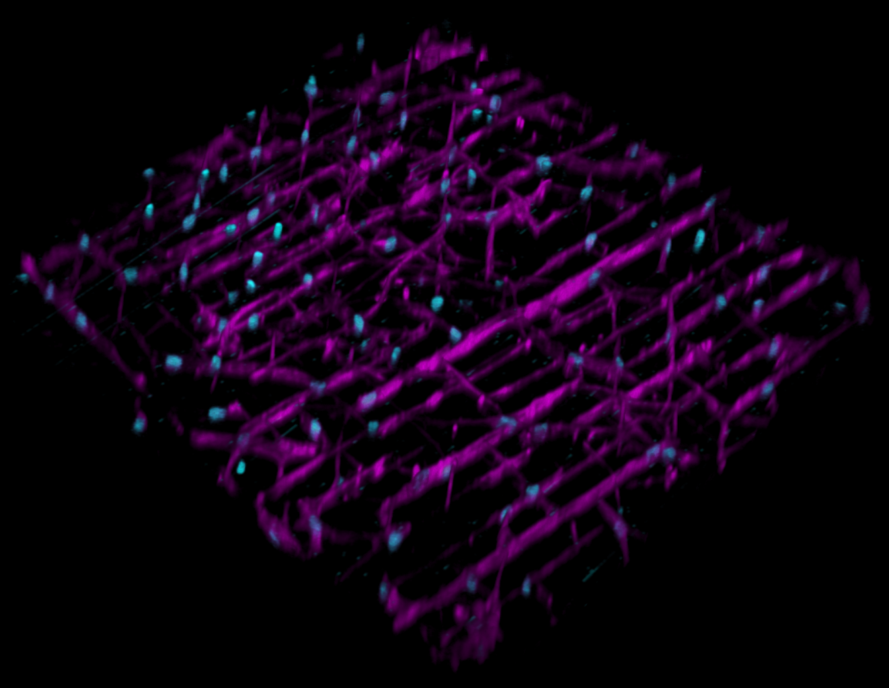

# network-quantification

## Overview

Automated quantification of cellular spreading and connectivity inside hydrogels patterned 
with laser ablation. ImageJ is used identify individual nuclei and skeletonize cell networks, as well as 
visualzing the results as overlay over the original images.
The two studies that were analyzed so far, exhibited strong and diverse background patterns that required a 
different segmentation approach for both.

## Prerequisites
1. FIJI-imagej [Downlaod FIJI](https://imagej.net/software/fiji/)
2. R and RStudio [Download R](https://cran.r-project.org/) [Download RStudio](https://www.rstudio.com/)
3. R packages: "tidyverse", "gtools"

## Usage
### ImageJ Macro

1. Save your images as individual .tif-files in one folder. Give them clear names. Separate tags with underscores.
2. Run the macro.
    - The "Enhance images" option does not alter the segmentation, only the quality of the results images
3. Output:
    - one folder with results images
    - one folder with 3 types of .csv-files: one file containing the nuclear counts for all images; network and branch 
    information for each image

### R
Metrics:
- total network length: total length of all skeletons that were identified in a given image
- longest network length: total length of the longes coherent network in a given image
- network count: number of individual networks in a given image
- mean network length: total network length / network count
- median network length: median network length in a given image
- count: number of nuclei in a given image
- normalized total network length: total network length / count
- normalized longest network length: longest network length / count

The results can be saved two ways:
1. Results for each individual image (results_by_sample)
2. Results summarized for each condition and timepoint (results_summary)
